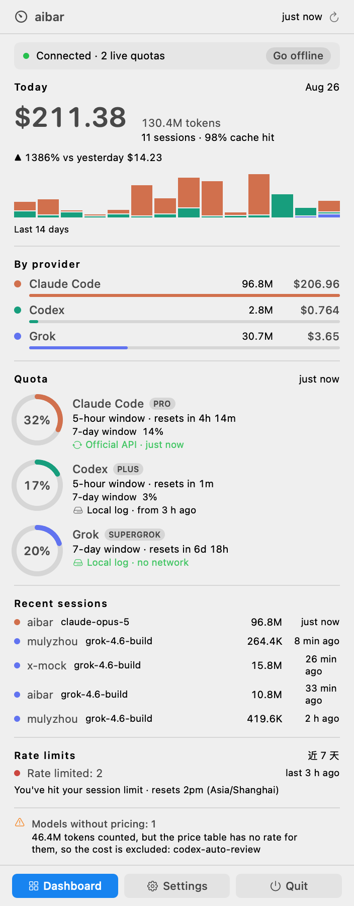
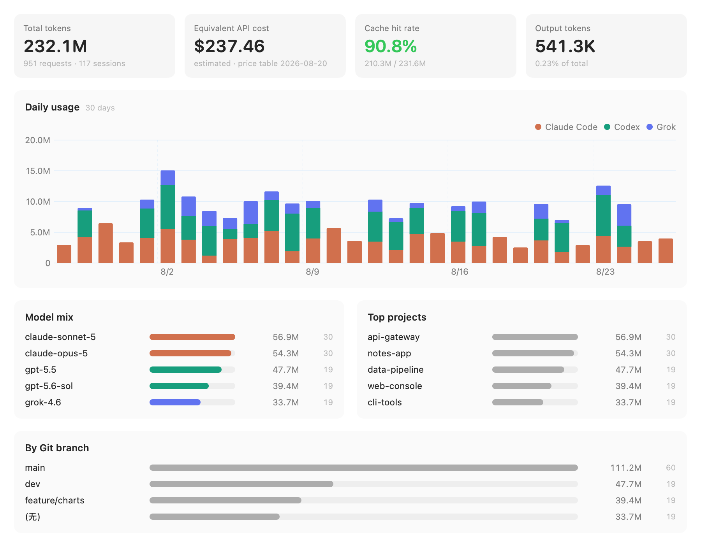

<h1 align="center">aibar</h1>

<p align="center">
  <b>English</b> | <a href="README.zh-CN.md">简体中文</a>
</p>

<p align="center">
  <a href="https://github.com/duskedge/aibar/actions/workflows/ci.yml"></a>
  <a href="LICENSE"></a>
  
  
</p>

**aibar** is a macOS menu bar app that puts token usage for **Claude Code, Codex and
Grok** in one place. It reads the CLIs' own local session logs — no proxy, no wrapper,
nothing between you and the tools you already use.

It answers two questions a coding session keeps raising: *how much have I burned today*,
and *can I keep going*.

## Screenshots

| Menu bar panel | Dashboard |
|---|---|
|  |  |

<sub>Demo data — reproduce with `aibar-shot --demo`.</sub>

## Features

- **Live quota for all three.** Codex and Grok read theirs straight from local logs;
  Claude's comes from the official endpoint. Nothing is inferred — if a number
  isn't available, aibar says so instead of guessing.
- **Cost in dollars.** Grok reports actual cost; Claude and Codex are estimated from a
  built-in price table and always labelled as estimates. Models with no price show `—`,
  never `$0`.
- **Where it went.** Break usage down by project, model, or Git branch, over any range.
- **Cache hit rate.** Usually the single biggest lever on your bill.
- **Rate-limit history.** How often you hit the wall, and when.
- **Menu bar, your way.** Pick which provider and which window to show, or just an icon.
- **Offline mode.** One click, always visible at the top of the panel.
- **CSV / JSON export**, English and 简体中文.

## Install

Grab the DMG from [Releases](https://github.com/duskedge/aibar/releases) and drag it to
Applications. Builds are currently unsigned, so clear the quarantine flag once:

```bash
xattr -dr com.apple.quarantine /Applications/aibar.app
```

Or right-click the app in Finder → Open → Open.

<details>
<summary>Why unsigned?</summary>

aibar reads `~/.claude`, `~/.codex` and `~/.grok`, which the App Sandbox does not allow,
so it ships as a Developer ID app. Signing and notarising need a paid Apple developer
account. Building it yourself avoids Gatekeeper entirely — see below.
</details>

## Privacy

Usage analysis is **100% local**. The only network requests aibar ever makes are:

- `api.anthropic.com` for your live Claude quota, using the credentials Claude Code
  already stored on your Mac
- `github.com` to check for a new release and download the DMG (no credentials)

That allowlist is a compile-time constant enforced by CI — any other host in the source
fails the build. Settings → Network Activity lists every request this run made, with
timestamps and status codes. Credentials stay in memory: never stored, logged, or exported.

Don't want any of it? Offline mode is one click, and everything except Claude's live
quota and update checks keeps working. Auto-update can also be turned off on its own
in Settings → Network.

## Architecture

```
Sources/
  AibarCore/     Parsing, storage, pricing, network — no UI
    Providers/   One adapter per CLI, behind a single protocol
    Ingest/      Streaming JSONL reader with resumable offsets, FSEvents watcher
    Store/       SQLite (system libsqlite3, zero third-party deps)
  aibarApp/      SwiftUI MenuBarExtra, dashboard, settings
  aibarCLI/      aibar scan / report / quota / export
```

SQLite handles live inside a single `actor`; the UI only ever receives immutable
snapshot values. Adding another CLI means implementing one protocol —
see [CONTRIBUTING.md](CONTRIBUTING.md).

## Build

```bash
git clone https://github.com/duskedge/aibar.git
cd aibar
swift build && swift test
./scripts/build-app.sh && open .build/manual/aibar.app
```

## License

MIT
