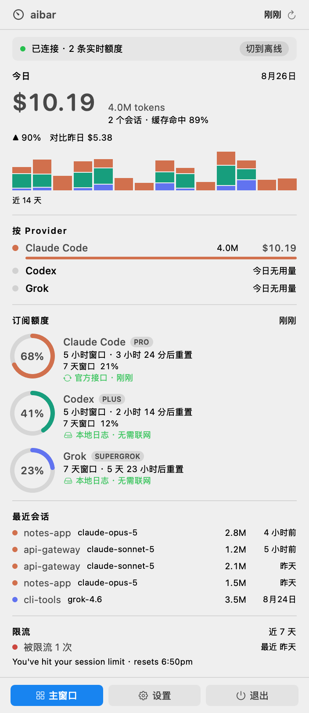
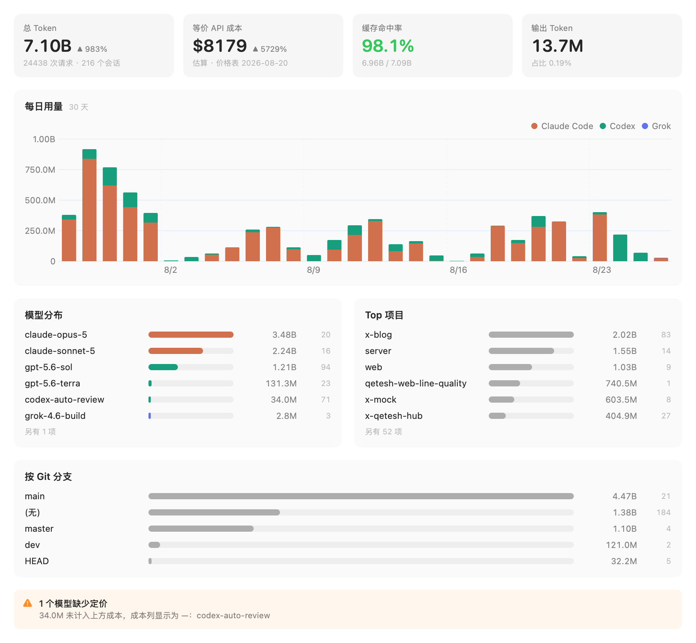

<h1 align="center">aibar</h1>

<p align="center">
  <a href="README.md">English</a> | <b>简体中文</b>
</p>

<p align="center">
  <a href="https://github.com/duskedge/aibar/actions/workflows/ci.yml"></a>
  <a href="LICENSE"></a>
  
  
</p>

**aibar** 是一个 macOS 菜单栏应用，把 **Claude Code、Codex、Grok** 三家的 token
用量汇到一处。它直接读各家 CLI 自己的本地会话日志 —— 不装代理、不套壳，
不在你和已经在用的工具之间加任何东西。

它回答写代码时反复出现的两个问题：**今天烧了多少**，以及**还能不能接着用**。

## 截图

| 快捷面板 | 仪表盘 |
|---|---|
|  |  |

<sub>演示数据，可用 `aibar-shot --demo` 复现。</sub>

## 功能

- **三家的实时额度。** Codex 和 Grok 的额度本地日志里就有；Claude 的走官方接口。
  一个数字都不靠推算 —— 拿不到就明说拿不到，不猜。
- **成本折算成美元。** Grok 回传真实成本；Claude 与 Codex 按内置价格表估算，
  界面上一律标注「估算」。缺定价的模型显示 `—`，不是 `$0`。
- **钱花在哪。** 按项目、模型、Git 分支拆分，时间范围任选。
- **缓存命中率。** 通常是账单上最大的一根杠杆。
- **限流记录。** 撞了几次墙、什么时候撞的。
- **菜单栏自己配。** 显示哪一家、哪个窗口，或者只留一个图标。
- **离线模式。** 一键切换，入口常驻面板顶部。
- **CSV / JSON 导出**，中英双语。

## 安装

从 [Releases](https://github.com/duskedge/aibar/releases) 下载 DMG 拖进「应用程序」。
目前的发布包未经签名，首次打开需要清一次隔离标记：

```bash
xattr -dr com.apple.quarantine /Applications/aibar.app
```

或者在「访达」里右键点 `aibar.app` → 打开 → 再点一次「打开」。

<details>
<summary>为什么没签名</summary>

aibar 要读 `~/.claude`、`~/.codex`、`~/.grok`，这些路径在 App Sandbox 里拿不到，
所以走 Developer ID 分发路线。签名与公证需要付费的 Apple 开发者账号。
自己构建可以完全绕开 Gatekeeper，见下文。
</details>

## 隐私

用量分析**全部在本地**。aibar 唯一会发出的网络请求是访问 `api.anthropic.com`
查询你的 Claude 实时额度，用的是 Claude Code 早已存在你 Mac 上的凭据。

这个白名单是编译期常量，由 CI 强制 —— 源码里出现任何其他域名，构建直接失败。
设置 → 网络活动会列出本次运行发出的每一个请求，带时间戳和状态码。
凭据只在内存中使用：不落库、不写日志、不进导出文件。

不想要？离线模式一键切换，除 Claude 实时额度外功能一个不少。

## 架构

```
Sources/
  AibarCore/     解析、存储、定价、网络 —— 不含任何 UI
    Providers/   每家 CLI 一个适配器，统一在一个协议后面
    Ingest/      可断点续读的流式 JSONL 读取器、FSEvents 监听
    Store/       SQLite（系统 libsqlite3，零第三方依赖）
  aibarApp/      SwiftUI MenuBarExtra、仪表盘、设置
  aibarCLI/      aibar scan / report / quota / export
```

SQLite 句柄完全关在一个 `actor` 里，UI 侧只拿不可变的快照值。
新增一家 CLI 只需实现一个协议，见 [CONTRIBUTING.md](CONTRIBUTING.md)。

## 构建

```bash
git clone https://github.com/duskedge/aibar.git
cd aibar
swift build && swift test
./scripts/build-app.sh && open .build/manual/aibar.app
```

## License

MIT
